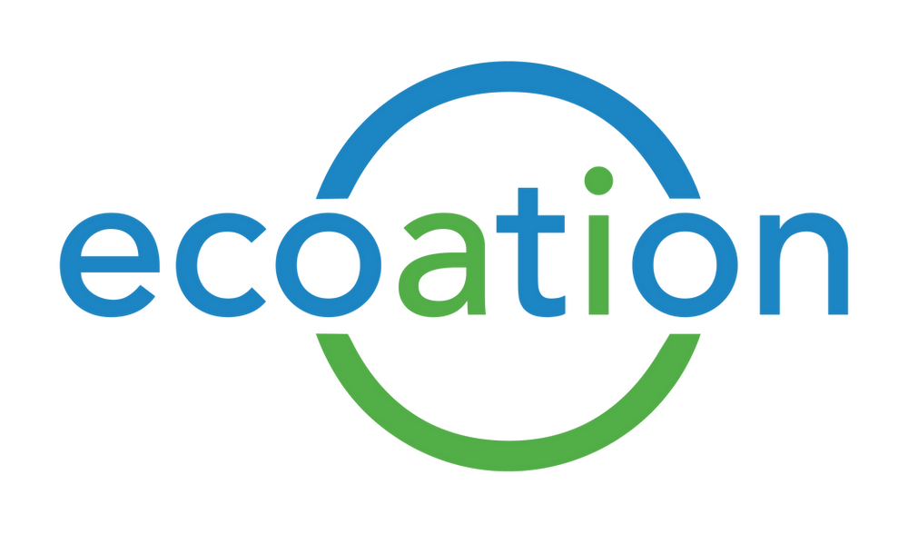
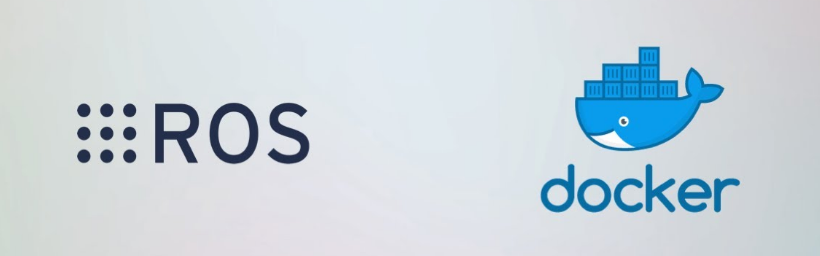

# Developing in ROS - My Co-op Experience with Ecoation Innovative Solutions Inc.
_January 9, 2022_

## Introduction

This blog post is dedicated to my two-term, co-op internship at Ecoation Innovative Solutions Inc. - a greenhouse robotics startup based in Vancouver, BC. I was on the robotics firmware team as an Embedded Software Engineer, working under the talented director of R&D, Patrick Wspanialy. 

## About Ecoation

Ecoation Innovative Solutions Inc. is an award-winning agricultural technology start-up, having designed and developed artificial intelligence (AI) and robotic vehicles that diagnose crop health in commercial greenhouses with minimal physical effort. Currently based in Vancouver, BC, Ecoation is focused on bringing the future of agriculture to focus, combining human knowledge and experience with machine precision and automation to increase operational visibility, assist growers and enhance decision making.

## Job Description

As an Embedded Software Engineer, my duties ranged from developing and testing automatic systems to monitor the performance of robots on the field to implementing localization and mapping tools for growers to use to observe robot pathing in the greenhouse. One of the many highlights of this internship was the collaboration between our robotics firmware team and another based in Poland, working together to build a robot for the greenhouse that was fully automated and integrated with our monitoring and mapping systems.

The very essence of a software engineer is their ability to adapt and overcome any challenges they come to face; being a part of Ecoation presented me with this exact opportunity as I had to work with new technologies daily, such as ROS (Robot Operating System) and Docker. These were a few of the skills I had to pick up on the job, ROS being a distributed framework of Python and C++, and Docker being an open-source containerization platform used to develop, manage and deploy virtualized environments.

---
## **Summer 2021 Goals**

### Expand on my knowledge by learning new languages, technologies, and frameworks that are popular in the software industry.

-	I challenged myself to learn new technology through viewing and replicating tutorials. This helped me to adopt a "learn it all" mindset, allowing me to put my research and development skills to use in order to find and build optimal solutions. By the end of the learning phase, I found myself comfortable using newfound technology, being able to grasp it quickly and implement it when needed (in this case, Docker and ROS).

### Learn how to work in a team environment and understand the difference between academic-grade and production-level code.

- Through working with my peers and leads, I was able to experience how engineers think and their approach to solving issues, being able to then incorporate that said mindset into my work, improving myself as a software engineering intern. At the end of the internship, I can reliably state that I can write, understand and communicate production-level code and ideas.

### Learn about how technologies are connected to one another, and what makes each unique.

- Curiosity is what fuels my passion for programming and software. During this internship, I was able to go beyond what a certain technology does, through researching how the technology is used, and the differences between their counterparts. With this in mind, I would deem myself successful in completing this goal as I can cohesively explain what a certain technology does in comparison to another, such as why ROS can use both Python and C++ in tandem.

## **Fall 2021 Goals**

### Learn and experiment with Docker.

- I made an effort to create a Docker container for each project I worked on during the internship. This put my research and knowledge about how Docker interacts with a computer system to the test, learning the minor details that made Docker work was essential. I was able to meet this goal, having implemented Docker without much difficulty in my project environment.

### Be comfortable in reading the documentation on ROS.

- Throughout this internship, I was working with and through ROS to accomplish the tasks and projects assigned to me, and so, it was inevitable that I would have to research ROS documentation and implement the techniques presented in my work. With that being said, I was able to confidently explain ROS code and its interaction with computer systems to peers, supervisors, consumers, and clients.

### 	Understand what goes into making a product that will be used by real-world clients.

- Having worked with a team provided me with insight as to how a product is built from the ground up. During this internship, I have been presented with the opportunity to see how our team has planned, designed, and developed robots for greenhouse clients. All in all, I believe my ability to successfully exchange ideas on how to develop a product with peers, supervisors, and clients have significantly improved.

---
## Conclusion

Ecoation Innovative Solutions Inc. will always have a place in my heart. Working alongside brilliant minds - all with the shared goal to bring agriculture and technology into one body is something that makes all the struggle worth it. They have taught me what it means to be a software engineer and for that, I could not ask more from my first internship. An absolute pleasure working alongside them.

## Acknowledgments

Of the many acknowledgments, I would like to thank Jennifer Irwin, the Human Resources Manager for Ecoation Innovative Solutions Inc., for presenting me with this opportunity and taking a chance with me as their intern. Alongside her, Patrick Wspanialy - director of R&D, mentor, punk lover, and robot enthusiast. He welcomed me into Ecoation and showed me the ropes early on, trusted my decisions, and helped me embrace any challenges I faced. I would like to share my gratitude with them for making my first co-op a memorable one and one that I would cherish! 👋😄

